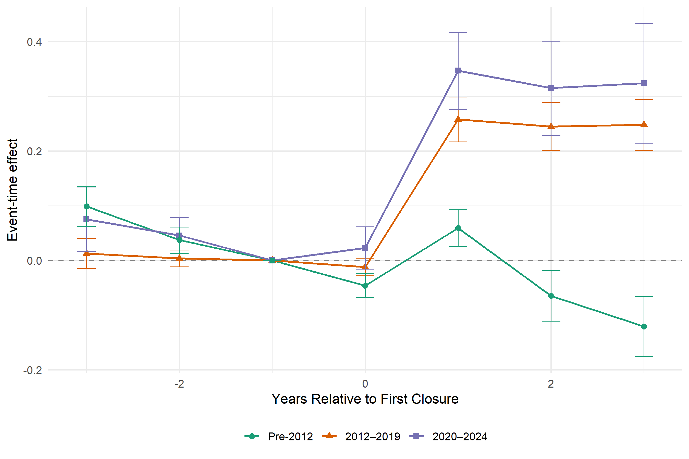

# Snapshot: 08-main-regressions

> All zip-year regressions (Sections 1–2, 4, 9–14) now include `log_total_deps` and `dep_growth_t3t1` as controls. Core finding unchanged: pre-2012 incumbent deposit reallocation (+0.12*** deposit-weighted) collapses to near-zero post-2012 (+0.010, n.s.). HMDA lending outcomes null across all periods. Own-closure regressions (Section 7) now use the bank-zip-year panel (reg_main_zip) replacing the earlier county-level panel; closure retention stable across periods (+0.57–0.66***). Sun & Abraham event study (Section 8) updated with new figure. Technology decomposition (Sections 9–14): small-bank and no-app closures drive pre-2012 effect; top-4 null pre-crisis; mobile penetration interaction −0.160*** in 2012–19; sophistication interaction uniformly insignificant in pre-digital period — the structural break dominates cross-sectional heterogeneity.

---

## 1. Count-Based Treatment — Zip-Year

**Unit:** zip-year  
**LHS:** `(inc_deps_{t+1} − inc_deps_t) / total_zip_deps_{t−1}` — 1-year window (t → t+1); denominator = total zip deposits at t−1  
**Treatment:** `fraction_of_branches_closed` = closed branch count / total branch count at t−1  
**Incumbent:** bank with NO closes in (zip, YEAR). Demographics filter (`!is.na(sophisticated)`) applied.  
**FE:** zip + county×year | **SE:** clustered at zip  
**Controls:** `log_n_branches`, `log_n_inc_banks`, `log_total_deps`, `dep_growth_t3t1`  
*Note: 2000–01 dropped due to dep_growth_t3t1 lag; N=51,558 after sophisticated filter.*

```
|                             | 2000–07    | 2008–11    | 2012–19    | 2020–24    |
| --------------------------- | ---------- | ---------- | ---------- | ---------- |
| fraction_of_branches_closed | 0.0931***  | 0.0326**   | 0.0126     | 0.0156     |
|                             | (0.0138)   | (0.0152)   | (0.0090)   | (0.0135)   |
| log_n_branches              | −0.0207**  | 0.0513***  | 0.0164*    | 0.0372***  |
|                             | (0.0089)   | (0.0113)   | (0.0085)   | (0.0123)   |
| log_n_inc_banks             | 0.0986***  | 0.0451***  | 0.0748***  | 0.0926***  |
|                             | (0.0080)   | (0.0086)   | (0.0069)   | (0.0106)   |
| log_total_deps              | −0.0979*** | −0.1192*** | −0.1048*** | −0.1047*** |
|                             | (0.0059)   | (0.0098)   | (0.0083)   | (0.0119)   |
| dep_growth_t3t1             | −0.0081*** | −0.0057    | −0.0036    | −0.0373*** |
|                             | (0.0022)   | (0.0044)   | (0.0028)   | (0.0057)   |
| N                           | 51,558     | 44,830     | 89,954     | 51,586     |
| Zip FE                      | Yes        | Yes        | Yes        | Yes        |
| County×Year FE              | Yes        | Yes        | Yes        | Yes        |
| SE                          | Zip        | Zip        | Zip        | Zip        |
| Mean(outcome)               | 0.049      | 0.037      | 0.062      | 0.054      |
| SD(fraction_closed)         | 0.057      | 0.053      | 0.060      | 0.069      |
| R²                          | 0.53996    | 0.48664    | 0.48156    | 0.56741    |
| Within R²                   | 0.06352    | 0.04588    | 0.04287    | 0.05684    |
```
*Note: \*\*\* p<0.01, \*\* p<0.05, \* p<0.10*

---

## 2. Deposit-Weighted Treatment — Zip-Year

**Unit:** zip-year  
**LHS:** `(inc_deps_{t+1} − inc_deps_t) / total_zip_deps_{t−1}` — same as Table 1  
**Treatment:** `share_deps_closed` = sum(closed_dep_{t−1}) / total_zip_dep_{t−1}  
**Incumbent:** bank with NO closes in (zip, YEAR)  
**FE:** zip + county×year | **SE:** clustered at zip  
**Controls:** `log_n_branches`, `log_n_inc_banks`, `log_total_deps`, `dep_growth_t3t1`

```
|                       | 2000–07    | 2008–11    | 2012–19    | 2020–24    |
| --------------------- | ---------- | ---------- | ---------- | ---------- |
| share_deps_closed     | 0.1208***  | 0.1048***  | 0.0098     | 0.0241*    |
|                       | (0.0205)   | (0.0216)   | (0.0100)   | (0.0128)   |
| log_n_branches        | −0.0145*   | 0.0474***  | 0.0194**   | 0.0370***  |
|                       | (0.0085)   | (0.0110)   | (0.0076)   | (0.0106)   |
| log_n_inc_banks       | 0.0890***  | 0.0499***  | 0.0713***  | 0.0934***  |
|                       | (0.0075)   | (0.0079)   | (0.0058)   | (0.0089)   |
| log_total_deps        | −0.0985*** | −0.1202*** | −0.1049*** | −0.1054*** |
|                       | (0.0059)   | (0.0098)   | (0.0083)   | (0.0122)   |
| dep_growth_t3t1       | −0.0081*** | −0.0054    | −0.0036    | −0.0371*** |
|                       | (0.0022)   | (0.0044)   | (0.0028)   | (0.0057)   |
| N                     | 51,558     | 44,830     | 89,954     | 51,586     |
| Zip FE                | Yes        | Yes        | Yes        | Yes        |
| County×Year FE        | Yes        | Yes        | Yes        | Yes        |
| SE                    | Zip        | Zip        | Zip        | Zip        |
| Mean(outcome)         | 0.049      | 0.037      | 0.062      | 0.054      |
| SD(share_deps_closed) | 0.034      | 0.033      | 0.047      | 0.060      |
| R²                    | 0.53982    | 0.48717    | 0.48155    | 0.56746    |
| Within R²             | 0.06325    | 0.04686    | 0.04285    | 0.05693    |
```
*Note: \*\*\* p<0.01, \*\* p<0.05, \* p<0.10*

---

## 3. Deposit-Weighted Treatment — County-Year Deposits

**Unit:** county-year  
**LHS:** `(inc_county_deps_{t+1} − inc_county_deps_{t−1}) / inc_county_deps_{t−1}` — 2-year symmetric window; denominator = incumbent own deposits at t−1  
**Treatment:** `share_deps_closed` — county-level deposit-weighted  
**Incumbent:** bank with NO closes in (county, YEAR)  
**FE:** county + state×year | **SE:** clustered at county  
**Controls:** `log_n_branches`, `log_n_banks`, `log1p_total_deps`, `county_dep_growth_t4_t1`, `log_population_density`, `lag_county_deposit_hhi`, `lag_establishment_gr`, `lag_payroll_gr`, `lag_hmda_mtg_amt_gr`, `lag_cra_loan_amount_amt_lt_1m_gr`, `lmi`  
*Note: always-positive result (+0.16–+0.23***), no digital-era decline. State×year FE weaker than county×year in zip spec — not preferred for identifying attenuation.*

```
|                                  | pre-2012            | 2012–2019   | 2020–2024   |
| -------------------------------- | ------------------- | ----------- | ----------- |
| share_deps_closed                | 0.1596***           | 0.2330***   | 0.2085***   |
|                                  | (0.0453)            | (0.0261)    | (0.0292)    |
| log_n_branches                   | 0.1504***           | −0.0098     | 0.1420***   |
| log_n_banks                      | 0.0489***           | 0.0967***   | 0.0846***   |
| log1p_total_deps                 | −0.3400***          | −0.3883***  | −0.5169***  |
| county_dep_growth_t4_t1          | −0.000              | 0.0602***   | 0.0013      |
| log_population_density           | 0.0738              | 0.4869***   | −0.1787***  |
| lag_county_deposit_hhi           | 0.0570              | −0.0991*    | 0.0040      |
| lag_establishment_gr             | 0.1521***           | 0.0951*     | −0.0199     |
| lag_payroll_gr                   | 0.0183              | 0.0901***   | −0.2240***  |
| lag_hmda_mtg_amt_gr              | 0.0243***           | −0.0150**   | −0.0032     |
| lag_cra_loan_amount_amt_lt_1m_gr | −0.0036             | −0.0011     | −0.0013     |
| lmi                              | dropped (collinear) | 0.0086      | 0.0011      |
| N                                | 23,426              | 23,593      | 14,567      |
| County FE                        | Yes                 | Yes         | Yes         |
| State×Year FE                    | Yes                 | Yes         | Yes         |
| SE                               | County              | County      | County      |
| Mean(dep_outcome)                | 0.078               | 0.081       | 0.127       |
| SD(share_deps_closed)            | 0.029               | 0.037       | 0.042       |
| Adj. R²                          | —                   | —           | —           |
| Within R²                        | 0.147               | 0.201       | 0.275       |
```
*Note: \*\*\* p<0.01, \*\* p<0.05, \* p<0.10*

---

## 4. HMDA New Purchase Mortgages — Zip-Year

**Unit:** zip-year  
**LHS:** `(inc_purch_hmda_{t+1} − inc_purch_hmda_{t−1}) / inc_purch_hmda_{t−1}` — 2-year symmetric window  
**HMDA filter:** `action_taken = '1'` AND `loan_purpose = '1'` (home purchase only)  
**Loan mapping:** census tract → zip via `RES_RATIO` from HUD USPS crosswalk (Dec 2019)  
**Treatment:** `share_deps_closed` (zip-level deposit-weighted)  
**Incumbent:** bank with NO closes in (zip, YEAR)  
**FE:** zip + county×year | **SE:** clustered at zip  
**Controls:** `log_n_branches`, `log_n_inc_banks`, `log_total_deps`, `dep_growth_t3t1`  
*Note: uniformly null treatment effect across all periods*

```
|                       | 2000–07    | 2008–11    | 2012–19    | 2020–24    |
| --------------------- | ---------- | ---------- | ---------- | ---------- |
| share_deps_closed     | −0.1716    | −0.3160    | 0.2751*    | 0.2151     |
|                       | (0.4047)   | (0.4370)   | (0.1638)   | (0.1723)   |
| log_n_branches        | −0.2904**  | 0.1738     | −0.1056    | 0.1682     |
|                       | (0.1369)   | (0.1480)   | (0.0952)   | (0.1163)   |
| log_n_inc_banks       | −0.1935    | −0.3336*** | −0.1814**  | −0.2330**  |
|                       | (0.1208)   | (0.1266)   | (0.0866)   | (0.1047)   |
| log_total_deps        | −0.1473**  | 0.1607     | −0.2695*** | −0.0373    |
|                       | (0.0714)   | (0.0979)   | (0.0461)   | (0.0875)   |
| dep_growth_t3t1       | 0.0701*    | −0.1427**  | 0.0786**   | 0.0121     |
|                       | (0.0379)   | (0.0617)   | (0.0380)   | (0.0647)   |
| N                     | 39,951     | 35,474     | 82,356     | 36,039     |
| Zip FE                | Yes        | Yes        | Yes        | Yes        |
| County×Year FE        | Yes        | Yes        | Yes        | Yes        |
| SE                    | Zip        | Zip        | Zip        | Zip        |
| Mean(hmda_purch_gr)   | 0.732      | 0.417      | 0.565      | 0.089      |
| SD(share_deps_closed) | 0.034      | 0.033      | 0.047      | 0.060      |
| R²                    | 0.47261    | 0.53690    | 0.38819    | 0.46282    |
| Within R²             | 0.00148    | 0.00083    | 0.00169    | 0.00085    |
```
*Note: \*\*\* p<0.01, \*\* p<0.05, \* p<0.10*

---

## 5. HMDA New Purchase Mortgages — County-Year

**Unit:** county-year  
**LHS:** `(inc_purch_hmda_{t+1} − inc_purch_hmda_{t−1}) / inc_purch_hmda_{t−1}` — 2-year symmetric window  
**HMDA filter:** `action_taken = '1'` AND `loan_purpose = '1'` (home purchase only)  
**Treatment:** `share_deps_closed` (county-level deposit-weighted)  
**Incumbent:** bank with NO closes in (county, YEAR)  
**FE:** county + state×year | **SE:** clustered at county  
**Controls:** `log1p_total_deps`, `county_dep_growth_t4_t1`, `lag_county_deposit_hhi`, `lag_payroll_gr`, `lag_hmda_mtg_amt_gr`, `lmi`

```
|                         | pre-2012            | 2012–2019  | 2020–2024  |
| ----------------------- | ------------------- | ---------- | ---------- |
| share_deps_closed       | −0.0948             | 0.0327     | 0.1809     |
|                         | (0.1910)            | (0.1676)   | (0.2118)   |
| log1p_total_deps        | −0.1647***          | −0.3471*** | −0.1851*   |
| county_dep_growth_t4_t1 | −0.0006***          | 0.0457***  | 0.0091**   |
| lag_county_deposit_hhi  | 0.4834**            | 0.5312**   | 0.5686*    |
| lag_payroll_gr          | −0.2715*            | −0.2217    | −0.0808    |
| lag_hmda_mtg_amt_gr     | −0.2659***          | −0.7276*** | −0.3603*** |
| lmi                     | dropped (collinear) | −0.0023    | 0.2249***  |
| N                       | 20,597              | 21,377     | 10,393     |
| County FE               | Yes                 | Yes        | Yes        |
| State×Year FE           | Yes                 | Yes        | Yes        |
| SE                      | County              | County     | County     |
| Mean(hmda_purch_gr)     | 0.133               | 0.211      | 0.077      |
| SD(share_deps_closed)   | 0.026               | 0.034      | 0.042      |
| Adj. R²                 | —                   | —          | —          |
| Within R²               | 0.005               | 0.013      | 0.008      |
```
*Note: \*\*\* p<0.01, \*\* p<0.05, \* p<0.10*

---

## 6. CRA Small-Business Lending — County-Year

**Unit:** county-year  
**LHS:** `(inc_cra_{t+1} − inc_cra_{t−1}) / inc_cra_{t−1}` — 2-year symmetric window  
**CRA measure:** `amt_loans_lt_100k + amt_loans_100k_250k + amt_loans_250k_1m` (table D1-1, `report_level = '040'`); amounts in thousands  
**Treatment:** `share_deps_closed` (county-level deposit-weighted)  
**Incumbent:** bank with NO closes in (county, YEAR)  
**FE:** county + state×year | **SE:** clustered at county  
**Controls:** `log1p_total_deps`, `log_population_density`, `lag_hmda_mtg_amt_gr`, `lag_cra_loan_amount_amt_lt_1m_gr`, `lmi`

```
|                                  | pre-2012            | 2012–2019  | 2020–2024  |
| -------------------------------- | ------------------- | ---------- | ---------- |
| share_deps_closed                | −0.1815             | 0.1040     | 0.2158     |
|                                  | (0.1981)            | (0.1654)   | (0.2241)   |
| log1p_total_deps                 | −0.0171             | −0.1762*** | 0.0300     |
| log_population_density           | 0.1787              | 1.047***   | 0.0744     |
| lag_hmda_mtg_amt_gr              | 0.0998**            | −0.1165    | 0.0491     |
| lag_cra_loan_amount_amt_lt_1m_gr | −0.4303***          | −0.6440*** | −0.7128*** |
| lmi                              | dropped (collinear) | 0.0173     | 0.0219     |
| N                                | 18,338              | 19,252     | 9,605      |
| County FE                        | Yes                 | Yes        | Yes        |
| State×Year FE                    | Yes                 | Yes        | Yes        |
| SE                               | County              | County     | County     |
| Mean(cra_growth)                 | 0.075               | 0.191      | −0.075     |
| SD(share_deps_closed)            | 0.031               | 0.032      | 0.039      |
| Adj. R²                          | —                   | —          | —          |
| Within R²                        | 0.017               | 0.027      | 0.042      |
```
*Note: \*\*\* p<0.01, \*\* p<0.05, \* p<0.10*

---

## 7. Deposit Growth at Remaining Branches — Bank-Zip-Year (Own-Closure Design)

**Unit:** bank-zip-year (reg_main_zip_20260420.rds)  
**LHS:** `growth_on_total_t1` = (deposits at remaining branches t+1 − t−1) / total bank-zip deposits at t−1 — 2-year symmetric window  
**Treatment:** `closure_share` = own closing deposits / total bank-zip deposits at t−1  
**Exclusions:** M&A-related closures (different owner within prior 3 years); top-5% extreme intensity  
**FE:** bank_id×YEAR + zip×YEAR | **SE:** clustered at bank_id  
**Controls:** `log1p(total_deps_bank_zip_t1)`, `log1p(n_remaining_branches)`, `mkt_share_zip_t1`

```
|                               | All          | Pre-2012   | 2012–2024  | 2012–2019  |
| ----------------------------- | ------------ | ---------- | ---------- | ---------- |
| closure_share                 | 0.6522***    | 0.5687***  | 0.6620***  | 0.6626***  |
|                               | (0.0203)     | (0.0274)   | (0.0218)   | (0.0173)   |
| log1p(total_deps_bank_zip_t1) | −0.1964***   | −0.2345*** | −0.1728*** | −0.1728*** |
|                               | (0.0048)     | (0.0053)   | (0.0063)   | (0.0053)   |
| log1p(n_remaining_branches)   | 0.2163***    | 0.2520***  | 0.1906***  | 0.1901***  |
|                               | (0.0095)     | (0.0112)   | (0.0097)   | (0.0102)   |
| mkt_share_zip_t1              | 0.2944***    | 0.3299***  | 0.2940***  | 0.3067***  |
|                               | (0.0130)     | (0.0171)   | (0.0151)   | (0.0194)   |
| N                             | 1,273,020    | 513,664    | 759,356    | 483,475    |
| Bank×Year FE                  | Yes          | Yes        | Yes        | Yes        |
| Zip×Year FE                   | Yes          | Yes        | Yes        | Yes        |
| SE                            | Bank         | Bank       | Bank       | Bank       |
| R²                            | 0.52207      | 0.58355    | 0.47499    | 0.45094    |
| Within R²                     | 0.19267      | 0.25477    | 0.15433    | 0.15723    |
```
*Note: \*\*\* p<0.01, \*\* p<0.05, \* p<0.10*

---

## 8. Sun & Abraham Event Study — Consistent Branch Set

**Unit:** bank-county-year  
**DV:** `log(1 + deposits)` at branches that do not close in the cohort year  
**Method:** Sun & Abraham (2021); cohort = first closure year; ref period = −1  
**FE:** unit_id + YEAR | **SE:** clustered at bank_id  
**Window:** ±3 years around first closure; 50% sampled never-treated controls (cohort = 10000)  
**Periods:** Pre-2012 | 2012–2019 | 2020–2024, superimposed  



```
| Period    | t=−3     | t=−2     | t=−1    | t=0       | t=1      | t=2       | t=3       |
| --------- | -------- | -------- | ------- | --------- | -------- | --------- | --------- |
| Pre-2012  | 0.099*** | 0.037*** | 0 (ref) | −0.046*** | 0.059*** | −0.065*** | −0.121*** |
| 2012–2019 | 0.013    | 0.004    | 0 (ref) | −0.012    | 0.258*** | 0.245***  | 0.248***  |
| 2020–2024 | 0.075**  | 0.046*** | 0 (ref) | 0.023     | 0.347*** | 0.315***  | 0.324***  |
| Unit FE   | Yes      | Yes      | Yes     | Yes       | Yes      | Yes       | Yes       |
| Year FE   | Yes      | Yes      | Yes     | Yes       | Yes      | Yes       | Yes       |
| SE        | Bank     | Bank     | Bank    | Bank      | Bank     | Bank      | Bank      |
```
*Note: \*\*\* p<0.01, \*\* p<0.05, \* p<0.10*

*Pre-trend: t=−2 small and insignificant across all periods. Pre-2012 post-event path reverses at t=2/t=3 (deposits not durably retained). Digital-era path persistent and monotone — deposits retained after own closures. Maps to Prediction 1 of theory model.*

---

---

## 9. Baseline — Zip-Year (Revised Spec)

**Unit:** zip × year  
**LHS:** `outcome = (inc_tp1 – inc_curr) / total_deps` — change in incumbent deposits normalized by total zip deposits, winsorized 2.5/97.5  
**Treatment:** `share_deps_closed` = deposits in closing branches / total zip deposits  
**Incumbent:** banks present in zip at t+1 that were present at t  
**FE:** zip + county×year | **SE:** clustered at zip  
**Controls:** `log_n_branches`, `log_n_inc_banks`, `log_total_deps`, `dep_growth_t3t1`  
*Note: revised spec adds `log_total_deps` and `dep_growth_t3t1` vs Sections 1–2. 2000–01 dropped due to lag. N differs from Section 2 (no no-open filter).*

```
|                    | 2000–07    | 2008–11    | 2012–19    | 2020–24    |
| ------------------ | ---------- | ---------- | ---------- | ---------- |
| share_deps_closed  | 0.1208***  | 0.1048***  | 0.0098     | 0.0241*    |
|                    | (0.0205)   | (0.0216)   | (0.0100)   | (0.0128)   |
| log_n_branches     | −0.0145*   | 0.0474***  | 0.0194**   | 0.0370***  |
|                    | (0.0085)   | (0.0110)   | (0.0076)   | (0.0106)   |
| log_n_inc_banks    | 0.0890***  | 0.0499***  | 0.0713***  | 0.0934***  |
|                    | (0.0075)   | (0.0079)   | (0.0058)   | (0.0089)   |
| log_total_deps     | −0.0985*** | −0.1202*** | −0.1049*** | −0.1054*** |
|                    | (0.0059)   | (0.0098)   | (0.0083)   | (0.0122)   |
| dep_growth_t3t1    | −0.0081*** | −0.0054    | −0.0036    | −0.0371*** |
|                    | (0.0022)   | (0.0044)   | (0.0028)   | (0.0057)   |
| N                  | 51,558     | 44,830     | 89,954     | 51,586     |
| Zip FE             | Yes        | Yes        | Yes        | Yes        |
| County×Year FE     | Yes        | Yes        | Yes        | Yes        |
| SE                 | Zip        | Zip        | Zip        | Zip        |
| Mean(outcome)      | 0.049      | 0.037      | 0.062      | 0.054      |
| SD(share_deps_cl.) | 0.034      | 0.033      | 0.047      | 0.060      |
| R²                 | 0.53982    | 0.48717    | 0.48155    | 0.56746    |
| Within R²          | 0.06325    | 0.04686    | 0.04285    | 0.05693    |
```
*Note: \*\*\* p<0.01, \*\* p<0.05, \* p<0.10*

---

## 10. Closing-Bank Size Decomposition — Zip-Year

**Treatment decomposition:**
- `share_deps_closed_top4` = deposits in top-4 (JPM/BAC/WFC/Citi) closing branches / total deps
- `share_deps_closed_large` = large-but-not-top4 (assets > $100B) closing branches / total deps
- `share_deps_closed_small` = all other closing branches / total deps

*Hypothesis: top-4 closures produce near-zero spillover; small-bank closures drive pre-2012 effect.*

```
|                          | 2000–07    | 2008–11    | 2012–19    | 2020–24    |
| ------------------------ | ---------- | ---------- | ---------- | ---------- |
| share_deps_closed_top4   | 0.0405     | 0.1051***  | −0.0331**  | 0.0199     |
|                          | (0.0404)   | (0.0340)   | (0.0141)   | (0.0144)   |
| share_deps_closed_large  | 0.1651***  | 0.0920**   | 0.0095     | 0.0249     |
|                          | (0.0386)   | (0.0394)   | (0.0147)   | (0.0212)   |
| share_deps_closed_small  | 0.1290***  | 0.1114***  | 0.0611***  | 0.0329     |
|                          | (0.0263)   | (0.0322)   | (0.0157)   | (0.0210)   |
| log_n_branches           | −0.0146*   | 0.0474***  | 0.0177**   | 0.0367***  |
|                          | (0.0085)   | (0.0110)   | (0.0076)   | (0.0107)   |
| log_n_inc_banks          | 0.0891***  | 0.0498***  | 0.0726***  | 0.0936***  |
|                          | (0.0075)   | (0.0079)   | (0.0058)   | (0.0089)   |
| log_total_deps           | −0.0984*** | −0.1203*** | −0.1047*** | −0.1054*** |
|                          | (0.0059)   | (0.0098)   | (0.0083)   | (0.0122)   |
| dep_growth_t3t1          | −0.0082*** | −0.0054    | −0.0035    | −0.0371*** |
|                          | (0.0022)   | (0.0044)   | (0.0028)   | (0.0057)   |
| N                        | 51,558     | 44,830     | 89,954     | 51,586     |
| Zip FE                   | Yes        | Yes        | Yes        | Yes        |
| County×Year FE           | Yes        | Yes        | Yes        | Yes        |
| SE                       | Zip        | Zip        | Zip        | Zip        |
| Mean(outcome)            | 0.049      | 0.037      | 0.062      | 0.054      |
| SD(share_deps_cl.)       | 0.034      | 0.033      | 0.047      | 0.060      |
| R²                       | 0.53992    | 0.48717    | 0.48180    | 0.56746    |
| Within R²                | 0.06345    | 0.04687    | 0.04331    | 0.05694    |
```
*Note: \*\*\* p<0.01, \*\* p<0.05, \* p<0.10*

---

## 11. Closing-Bank App Decomposition — Zip-Year

**Treatment decomposition:**
- `share_deps_closed_app` = deposits in non-top4 closing branches with mobile app / total deps
- `share_deps_closed_noapp` = deposits in closing branches without mobile app / total deps

*Hypothesis: app-bank closures produce less reallocation; both converge to zero post-2012 as app coverage expands.*

```
|                          | 2000–07    | 2008–11    | 2012–19    | 2020–24    |
| ------------------------ | ---------- | ---------- | ---------- | ---------- |
| share_deps_closed_app    | 0.2816     | 0.1378***  | 0.0267**   | 0.0248     |
|                          | (0.1717)   | (0.0523)   | (0.0122)   | (0.0164)   |
| share_deps_closed_noapp  | 0.1194***  | 0.0919***  | 0.0850***  | 0.0131     |
|                          | (0.0206)   | (0.0285)   | (0.0232)   | (0.0498)   |
| log_n_branches           | −0.0145*   | 0.0506***  | 0.0148*    | 0.0399***  |
|                          | (0.0085)   | (0.0110)   | (0.0076)   | (0.0106)   |
| log_n_inc_banks          | 0.0890***  | 0.0452***  | 0.0765***  | 0.0894***  |
|                          | (0.0075)   | (0.0077)   | (0.0054)   | (0.0080)   |
| log_total_deps           | −0.0985*** | −0.1198*** | −0.1051*** | −0.1050*** |
|                          | (0.0059)   | (0.0098)   | (0.0083)   | (0.0120)   |
| dep_growth_t3t1          | −0.0081*** | −0.0055    | −0.0035    | −0.0372*** |
|                          | (0.0022)   | (0.0044)   | (0.0028)   | (0.0057)   |
| N                        | 51,558     | 44,830     | 89,954     | 51,586     |
| Zip FE                   | Yes        | Yes        | Yes        | Yes        |
| County×Year FE           | Yes        | Yes        | Yes        | Yes        |
| SE                       | Zip        | Zip        | Zip        | Zip        |
| Mean(outcome)            | 0.049      | 0.037      | 0.062      | 0.054      |
| SD(share_deps_cl.)       | 0.034      | 0.033      | 0.047      | 0.060      |
| R²                       | 0.53984    | 0.48695    | 0.48173    | 0.56743    |
| Within R²                | 0.06328    | 0.04645    | 0.04318    | 0.05688    |
```
*Note: \*\*\* p<0.01, \*\* p<0.05, \* p<0.10*

---

## 12. Mobile Penetration Interaction — Zip-Year

**Additional variable:** `perc_hh_wMobileSub` = county-year share of households with mobile subscription (raw data: 2007–2023; LOCF-filled within county; 2023 value held for 2024+)  
**Interaction:** `share_deps_closed × perc_hh_wMobileSub`  
**FE:** zip + county×year | **SE:** clustered at zip  
*Sample restricted to 2012+ — pre-2012 mobile data coverage insufficient.*  
*Hypothesis: high-mobile counties show less reallocation; digital infrastructure substitutes for physical branch access.*

```
|                                               | 2012–24    | 2012–19    | 2020–24    |
| --------------------------------------------- | ---------- | ---------- | ---------- |
| share_deps_closed                             | 0.0453*    | 0.1000***  | −0.6460*** |
|                                               | (0.0234)   | (0.0276)   | (0.1802)   |
| share_deps_closed × perc_hh_wMobileSub        | −0.0777**  | −0.1604*** | 0.8055***  |
|                                               | (0.0304)   | (0.0405)   | (0.2104)   |
| log_n_branches                                | 0.0148***  | 0.0134*    | 0.0452***  |
|                                               | (0.0057)   | (0.0078)   | (0.0128)   |
| log_n_inc_banks                               | 0.0682***  | 0.0733***  | 0.1015***  |
|                                               | (0.0046)   | (0.0060)   | (0.0106)   |
| log_total_deps                                | −0.0849*** | −0.1017*** | −0.0832*** |
|                                               | (0.0057)   | (0.0084)   | (0.0131)   |
| dep_growth_t3t1                               | −0.0027    | −0.0031    | −0.0674*** |
|                                               | (0.0023)   | (0.0029)   | (0.0072)   |
| N                                             | 102,644    | 70,195     | 32,230     |
| Zip FE                                        | Yes        | Yes        | Yes        |
| County×Year FE                                | Yes        | Yes        | Yes        |
| SE                                            | Zip        | Zip        | Zip        |
| Mean(outcome)                                 | 0.068      | 0.071      | 0.060      |
| SD(share_deps_cl.)                            | 0.057      | 0.051      | 0.068      |
| R²                                            | 0.45112    | 0.44590    | 0.59192    |
| Within R²                                     | 0.04115    | 0.04342    | 0.06161    |
```
*Note: \*\*\* p<0.01, \*\* p<0.05, \* p<0.10*

---

## 13. Combined Decomposition (Post-2012) — Zip-Year

**All channels simultaneously, post-2012 sample.** Separate coefficients for app, no-app, top4; interaction with mobile penetration on aggregate closure share.  
*Col (1): 2012–24. Col (2): 2012–19.*

```
|                                               | 2012–24    | 2012–19    |
| --------------------------------------------- | ---------- | ---------- |
| share_deps_closed_app                         | 0.0401*    | 0.0981***  |
|                                               | (0.0239)   | (0.0282)   |
| share_deps_closed_noapp                       | 0.0689**   | 0.1329***  |
|                                               | (0.0282)   | (0.0333)   |
| share_deps_closed_top4                        | 0.0058     | 0.0519*    |
|                                               | (0.0259)   | (0.0312)   |
| share_deps_closed × perc_hh_wMobileSub        | −0.0536*   | −0.1363*** |
|                                               | (0.0312)   | (0.0412)   |
| log_n_branches                                | 0.0142**   | 0.0127     |
|                                               | (0.0057)   | (0.0079)   |
| log_n_inc_banks                               | 0.0688***  | 0.0741***  |
|                                               | (0.0046)   | (0.0060)   |
| log_total_deps                                | −0.0849*** | −0.1016*** |
|                                               | (0.0057)   | (0.0084)   |
| dep_growth_t3t1                               | −0.0027    | −0.0031    |
|                                               | (0.0023)   | (0.0029)   |
| N                                             | 102,644    | 70,195     |
| Zip FE                                        | Yes        | Yes        |
| County×Year FE                                | Yes        | Yes        |
| SE                                            | Zip        | Zip        |
| Mean(outcome)                                 | 0.068      | 0.071      |
| SD(share_deps_cl.)                            | 0.057      | 0.051      |
| R²                                            | 0.45121    | 0.44604    |
| Within R²                                     | 0.04130    | 0.04367    |
```
*Note: \*\*\* p<0.01, \*\* p<0.05, \* p<0.10*

---

## 14. Depositor Sophistication Interaction — Zip-Year

**Interaction:** `share_deps_closed × sophisticated` where `sophisticated` is a zip×year binary from the demographics panel (above-median education AND above-median dividend/capital-gain income).  
**Main effect of `sophisticated` included** (dropped in 2000–07 due to collinearity with zip FE).  
*2012–19 split into 2012–13 and 2014–19 to detect when sophistication heterogeneity emerges.*  
*Hypothesis: negative interaction in digital era — sophisticated depositors substitute to digital channels first.*

```
|                                    | 2000–07    | 2008–11    | 2012–13    | 2014–19    | 2020–24    |
| ---------------------------------- | ---------- | ---------- | ---------- | ---------- | ---------- |
| share_deps_closed                  | 0.1219***  | 0.1147***  | 0.0899**   | 0.0208     | 0.0070     |
|                                    | (0.0275)   | (0.0301)   | (0.0403)   | (0.0150)   | (0.0171)   |
| share_deps_closed × sophisticated  | −0.0024    | −0.0179    | 0.0093     | −0.0338**  | 0.0308*    |
|                                    | (0.0375)   | (0.0390)   | (0.0480)   | (0.0172)   | (0.0183)   |
| sophisticated                      |            | 0.0022     | 0.0058     | 0.0039     | −0.0004    |
|                                    |            | (0.0068)   | (0.0061)   | (0.0027)   | (0.0050)   |
| log_n_branches                     | −0.0145*   | 0.0474***  | −0.0723*** | 0.0314***  | 0.0372***  |
|                                    | (0.0085)   | (0.0110)   | (0.0219)   | (0.0101)   | (0.0106)   |
| log_n_inc_banks                    | 0.0890***  | 0.0500***  | 0.0125     | 0.0791***  | 0.0934***  |
|                                    | (0.0075)   | (0.0079)   | (0.0180)   | (0.0073)   | (0.0089)   |
| log_total_deps                     | −0.0985*** | −0.1202*** | −0.0332*   | −0.1071*** | −0.1054*** |
|                                    | (0.0059)   | (0.0098)   | (0.0179)   | (0.0127)   | (0.0122)   |
| dep_growth_t3t1                    | −0.0081*** | −0.0054    | 0.0004     | −0.0208*** | −0.0371*** |
|                                    | (0.0022)   | (0.0044)   | (0.0083)   | (0.0052)   | (0.0057)   |
| N                                  | 51,558     | 44,830     | 22,868     | 66,796     | 51,586     |
| Zip FE                             | Yes        | Yes        | Yes        | Yes        | Yes        |
| County×Year FE                     | Yes        | Yes        | Yes        | Yes        | Yes        |
| SE                                 | Zip        | Zip        | Zip        | Zip        | Zip        |
| Mean(outcome)                      | 0.049      | 0.037      | 0.037      | 0.071      | 0.054      |
| SD(share_deps_cl.)                 | 0.034      | 0.033      | 0.040      | 0.049      | 0.060      |
| R²                                 | 0.53982    | 0.48717    | 0.64535    | 0.51108    | 0.56750    |
| Within R²                          | 0.06325    | 0.04687    | 0.00453    | 0.04533    | 0.05702    |
```
*Note: \*\*\* p<0.01, \*\* p<0.05, \* p<0.10*

*2012–13 transition: reallocation still present (0.090**), sophistication not yet a moderator (+0.009, n.s.). 2014–19: interaction turns negative and significant (−0.034**) — sophisticated zips show meaningfully less reallocation once digital adoption is widespread.*

---

*Sources: `code/approach-incumbent-reallocation/main_regressions.qmd`, `code/approach-technology-sorting/01_build_zip_tech_sample_20260419.R`, `code/approach-technology-sorting/02_zip_tech_regressions_20260419.qmd`*
