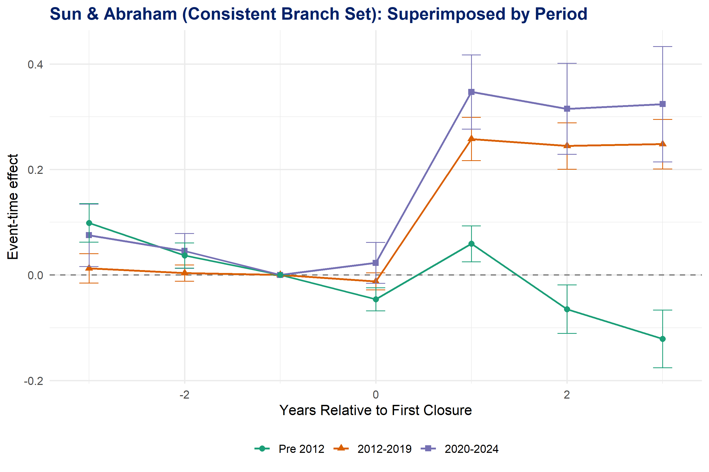

# Snapshot: 08-main-regressions

> Incumbent banks absorb competitor-closure deposits in the pre-digital era but not in the digital era. Zip-level regressions show strong positive deposit reallocation pre-2012 (+0.095–+0.117***) collapsing to near-zero or negative post-2012. Lending outcomes (HMDA purchase mortgages, CRA small-business) are null across all periods — incumbents do not translate deposit inflows into new credit origination. Own-closure analysis (Section 7) confirms deposit retention at remaining branches with large positive coefficients stable across periods. Sun & Abraham event study (Section 8) confirms no pre-trend and persistent retention in the digital era, with pre-digital-era deposits reversing post-event.

---

## 1. NRS (2026) Table 14 Replication — Count-Based Treatment, Zip-Year

**Unit:** zip-year  
**LHS:** `(inc_deps_{t+1} − inc_deps_t) / total_zip_deps_{t−1}` — 1-year window (t → t+1); denominator = total zip deposits at t−1  
**Treatment:** `fraction_of_branches_closed` = closed branch count / total branch count at t−1  
**Incumbent:** bank with NO closes in (zip, YEAR). Demographics filter (`!is.na(sophisticated)`) applied.  
**FE:** zip + county×year | **SE:** clustered at zip  
**Controls:** `log_n_branches`, `log_n_inc_banks`  
*Note: N=70,727 vs NRS reference 73,123 — gap from OTS filter not implemented.*

```
|                             | 2000–07    | 2008–11    | 2012–19    | 2020–24    |
| --------------------------- | ---------- | ---------- | ---------- | ---------- |
| fraction_of_branches_closed | 0.0951***  | 0.0369     | 0.0060     | 0.0040     |
|                             | (0.0114)   | (0.0150)   | (0.0092)   | (0.0140)   |
| log_n_branches              | −0.1215*** | −0.0632*** | −0.0626*** | −0.0740*** |
| log_n_inc_banks             | 0.0835***  | 0.0334***  | 0.0584***  | 0.0659***  |
| N                           | 70,727     | 44,953     | 89,982     | 51,601     |
| Zip FE                      | Yes        | Yes        | Yes        | Yes        |
| County×Year FE              | Yes        | Yes        | Yes        | Yes        |
| SE                          | Zip        | Zip        | Zip        | Zip        |
| Mean(gr_zip_inc)            | 0.048      | 0.037      | 0.062      | 0.054      |
| SD(fraction_closed)         | 0.057      | 0.053      | 0.060      | 0.069      |
| Adj. R²                     | —          | —          | —          | —          |
| Within R²                   | 0.015      | 0.003      | 0.004      | 0.005      |
```
*Note: \*\*\* p<0.01, \*\* p<0.05, \* p<0.10*

---

## 2. Deposit-Weighted Treatment — Zip-Year

**Unit:** zip-year  
**LHS:** `(inc_deps_{t+1} − inc_deps_t) / total_zip_deps_{t−1}` — same as Table 1  
**Treatment:** `share_deps_closed` = sum(closed_dep_{t−1}) / total_zip_dep_{t−1} — deposit-weighted analog to Table 1  
**Incumbent:** bank with NO closes in (zip, YEAR)  
**FE:** zip + county×year | **SE:** clustered at zip  
**Controls:** `log_n_branches`, `log_n_inc_banks`

```
|                       | 2000–07    | 2008–11    | 2012–19   | 2020–24    |
| --------------------- | ---------- | ---------- | --------- | ---------- |
| share_deps_closed     | 0.1167***  | 0.0843***  | −0.0170*  | −0.0178    |
|                       | (0.0156)   | (0.0219)   | (0.0101)  | (0.0119)   |
| log_n_branches        | −0.1155*** | −0.0647*** | −0.0557** | −0.0659*** |
| log_n_inc_banks       | 0.0743***  | 0.0341***  | 0.0501*** | 0.0571***  |
| N                     | 70,727     | 44,953     | 89,982    | 51,601     |
| Zip FE                | Yes        | Yes        | Yes       | Yes        |
| County×Year FE        | Yes        | Yes        | Yes       | Yes        |
| SE                    | Zip        | Zip        | Zip       | Zip        |
| Mean(gr_zip_inc)      | 0.048      | 0.037      | 0.062     | 0.054      |
| SD(share_deps_closed) | 0.038      | 0.033      | 0.047     | 0.060      |
| Adj. R²               | —          | —          | —         | —          |
| Within R²             | 0.014      | 0.003      | 0.004     | 0.005      |
```
*Note: \*\*\* p<0.01, \*\* p<0.05, \* p<0.10*

---

## 3. Deposit-Weighted Treatment — County-Year Deposits

**Unit:** county-year  
**LHS:** `(inc_county_deps_{t+1} − inc_county_deps_{t−1}) / inc_county_deps_{t−1}` — 2-year symmetric window; denominator = incumbent own deposits at t−1  
**Treatment:** `share_deps_closed` — county-level deposit-weighted  
**Incumbent:** bank with NO closes in (county, YEAR)  
**FE:** county + state×year | **SE:** clustered at county  
**Controls:** `log_n_branches`, `log_n_banks`, `log1p_total_deps`, `county_dep_growth_t4_t1`, `log_population_density`, `lag_county_deposit_hhi`, `lag_establishment_gr`, `lag_payroll_gr`, `lag_hmda_mtg_amt_gr`, `lag_cra_loan_amount_amt_lt_1m_gr`, `lmi`  
*Note: always-positive result (+0.16–+0.23***), no digital-era decline. State×year FE weaker than county×year in zip spec — not preferred for identifying attenuation.*

```
|                                  | pre-2012            | 2012–2019   | 2020–2024   |
| -------------------------------- | ------------------- | ----------- | ----------- |
| share_deps_closed                | 0.1596***           | 0.2330***   | 0.2085***   |
|                                  | (0.0453)            | (0.0261)    | (0.0292)    |
| log_n_branches                   | 0.1504***           | −0.0098     | 0.1420***   |
| log_n_banks                      | 0.0489***           | 0.0967***   | 0.0846***   |
| log1p_total_deps                 | −0.3400***          | −0.3883***  | −0.5169***  |
| county_dep_growth_t4_t1          | −0.000              | 0.0602***   | 0.0013      |
| log_population_density           | 0.0738              | 0.4869***   | −0.1787***  |
| lag_county_deposit_hhi           | 0.0570              | −0.0991*    | 0.0040      |
| lag_establishment_gr             | 0.1521***           | 0.0951*     | −0.0199     |
| lag_payroll_gr                   | 0.0183              | 0.0901***   | −0.2240***  |
| lag_hmda_mtg_amt_gr              | 0.0243***           | −0.0150**   | −0.0032     |
| lag_cra_loan_amount_amt_lt_1m_gr | −0.0036             | −0.0011     | −0.0013     |
| lmi                              | dropped (collinear) | 0.0086      | 0.0011      |
| N                                | 23,426              | 23,593      | 14,567      |
| County FE                        | Yes                 | Yes         | Yes         |
| State×Year FE                    | Yes                 | Yes         | Yes         |
| SE                               | County              | County      | County      |
| Mean(dep_outcome)                | 0.078               | 0.081       | 0.127       |
| SD(share_deps_closed)            | 0.029               | 0.037       | 0.042       |
| Adj. R²                          | —                   | —           | —           |
| Within R²                        | 0.147               | 0.201       | 0.275       |
```
*Note: \*\*\* p<0.01, \*\* p<0.05, \* p<0.10*

---

## 4. HMDA New Purchase Mortgages — Zip-Year

**Unit:** zip-year  
**LHS:** `(inc_purch_hmda_{t+1} − inc_purch_hmda_{t−1}) / inc_purch_hmda_{t−1}` — 2-year symmetric window  
**HMDA filter:** `action_taken = '1'` (originated) AND `loan_purpose = '1'` (home purchase only)  
**Loan mapping:** census tract → zip via `RES_RATIO` from HUD USPS crosswalk (December 2019). Loans apportioned proportionally where tracts straddle multiple zip codes.  
**Treatment:** `share_deps_closed` (zip-level deposit-weighted)  
**Incumbent:** bank with NO closes in (zip, YEAR)  
**FE:** zip + county×year | **SE:** clustered at zip  
**Controls:** `log_n_branches`, `log_n_inc_banks`  
*Note: outlier-sensitive — 2012-19 coeff unstable under winsorization (flips sign). Treat with caution.*

```
|                       | 2000–07    | 2008–11    | 2012–19    | 2020–24   |
| --------------------- | ---------- | ---------- | ---------- | --------- |
| share_deps_closed     | 0.0406     | −0.3000    | 0.2169     | 0.2040    |
|                       | (0.2846)   | (0.4456)   | (0.1631)   | (0.1691)  |
| log_n_branches        | −0.3636*** | 0.2080     | −0.2741*** | 0.1498    |
| log_n_inc_banks       | −0.0238    | −0.3382*** | −0.2245*** | −0.2400** |
| N                     | 53,607     | 35,524     | 82,376     | 36,039    |
| Zip FE                | Yes        | Yes        | Yes        | Yes       |
| County×Year FE        | Yes        | Yes        | Yes        | Yes       |
| SE                    | Zip        | Zip        | Zip        | Zip       |
| Mean(hmda_purch_gr)   | 0.732      | 0.417      | 0.565      | 0.089     |
| SD(share_deps_closed) | 0.036      | 0.032      | 0.046      | 0.062     |
| Adj. R²               | —          | —          | —          | —         |
| Within R²             | 0.001      | 0.000      | 0.001      | 0.001     |
```
*Note: \*\*\* p<0.01, \*\* p<0.05, \* p<0.10*

---

## 5. HMDA New Purchase Mortgages — County-Year

**Unit:** county-year  
**LHS:** `(inc_purch_hmda_{t+1} − inc_purch_hmda_{t−1}) / inc_purch_hmda_{t−1}` — 2-year symmetric window  
**HMDA filter:** `action_taken = '1'` AND `loan_purpose = '1'` (home purchase only)  
**Treatment:** `share_deps_closed` (county-level deposit-weighted)  
**Incumbent:** bank with NO closes in (county, YEAR)  
**FE:** county + state×year | **SE:** clustered at county  
**Controls:** `log1p_total_deps`, `county_dep_growth_t4_t1`, `lag_county_deposit_hhi`, `lag_payroll_gr`, `lag_hmda_mtg_amt_gr`, `lmi`

```
|                         | pre-2012            | 2012–2019  | 2020–2024  |
| ----------------------- | ------------------- | ---------- | ---------- |
| share_deps_closed       | −0.0948             | 0.0327     | 0.1809     |
|                         | (0.1910)            | (0.1676)   | (0.2118)   |
| log1p_total_deps        | −0.1647***          | −0.3471*** | −0.1851*   |
| county_dep_growth_t4_t1 | −0.0006***          | 0.0457***  | 0.0091**   |
| lag_county_deposit_hhi  | 0.4834**            | 0.5312**   | 0.5686*    |
| lag_payroll_gr          | −0.2715*            | −0.2217    | −0.0808    |
| lag_hmda_mtg_amt_gr     | −0.2659***          | −0.7276*** | −0.3603*** |
| lmi                     | dropped (collinear) | −0.0023    | 0.2249***  |
| N                       | 20,597              | 21,377     | 10,393     |
| County FE               | Yes                 | Yes        | Yes        |
| State×Year FE           | Yes                 | Yes        | Yes        |
| SE                      | County              | County     | County     |
| Mean(hmda_purch_gr)     | 0.133               | 0.211      | 0.077      |
| SD(share_deps_closed)   | 0.026               | 0.034      | 0.042      |
| Adj. R²                 | —                   | —          | —          |
| Within R²               | 0.005               | 0.013      | 0.008      |
```
*Note: \*\*\* p<0.01, \*\* p<0.05, \* p<0.10*

---

## 6. CRA Small-Business Lending — County-Year

**Unit:** county-year  
**LHS:** `(inc_cra_{t+1} − inc_cra_{t−1}) / inc_cra_{t−1}` — 2-year symmetric window  
**CRA measure:** `amt_loans_lt_100k + amt_loans_100k_250k + amt_loans_250k_1m` (table D1-1, `report_level = '040'`); amounts in thousands  
**Treatment:** `share_deps_closed` (county-level deposit-weighted)  
**Incumbent:** bank with NO closes in (county, YEAR)  
**FE:** county + state×year | **SE:** clustered at county  
**Controls:** `log1p_total_deps`, `log_population_density`, `lag_hmda_mtg_amt_gr`, `lag_cra_loan_amount_amt_lt_1m_gr`, `lmi`

```
|                                  | pre-2012            | 2012–2019  | 2020–2024  |
| -------------------------------- | ------------------- | ---------- | ---------- |
| share_deps_closed                | −0.1815             | 0.1040     | 0.2158     |
|                                  | (0.1981)            | (0.1654)   | (0.2241)   |
| log1p_total_deps                 | −0.0171             | −0.1762*** | 0.0300     |
| log_population_density           | 0.1787              | 1.047***   | 0.0744     |
| lag_hmda_mtg_amt_gr              | 0.0998**            | −0.1165    | 0.0491     |
| lag_cra_loan_amount_amt_lt_1m_gr | −0.4303***          | −0.6440*** | −0.7128*** |
| lmi                              | dropped (collinear) | 0.0173     | 0.0219     |
| N                                | 18,338              | 19,252     | 9,605      |
| County FE                        | Yes                 | Yes        | Yes        |
| State×Year FE                    | Yes                 | Yes        | Yes        |
| SE                               | County              | County     | County     |
| Mean(cra_growth)                 | 0.075               | 0.191      | −0.075     |
| SD(share_deps_closed)            | 0.031               | 0.032      | 0.039      |
| Adj. R²                          | —                   | —          | —          |
| Within R²                        | 0.017               | 0.027      | 0.042      |
```
*Note: \*\*\* p<0.01, \*\* p<0.05, \* p<0.10*

---

## 7. Deposit Growth at Remaining Branches — Bank-County-Year (Own-Closure Design)

**Unit:** bank-county-year  
**LHS:** `growth_on_total_t1` = (deposits at remaining branches t+1 − t−1) / total bank-county deposits at t−1 — 2-year symmetric window  
**Treatment:** `closure_share` = own closing deposits / total bank-county deposits at t−1  
**Exclusions:** M&A-related closures (different owner within prior 3 years); top-5% extreme intensity  
**FE:** bank_id×YEAR + county×YEAR | **SE:** clustered at bank_id  
**Controls:** `log1p(total_deps_bank_county_t1)`, `log1p(n_remaining_branches)`, `mkt_share_county_t1`  
*Note: Pre-2012 N=178,022 and 2012-2019 N=173,127 match reference HTML exactly.*

```
|                                  | All        | Pre-2012   | 2012–2024  | 2012–2019  |
| -------------------------------- | ---------- | ---------- | ---------- | ---------- |
| closure_share                    | 0.6593***  | 0.5378***  | 0.6823***  | 0.6685***  |
|                                  | (0.0204)   | (0.0312)   | (0.0220)   | (0.0249)   |
| log1p(total_deps_bank_county_t1) | −0.1663*** | −0.1985*** | −0.1467*** | −0.1422*** |
|                                  | (0.0036)   | (0.0048)   | (0.0042)   | (0.0045)   |
| log1p(n_remaining_branches)      | 0.1873***  | 0.2272***  | 0.1621***  | 0.1546***  |
|                                  | (0.0060)   | (0.0070)   | (0.0065)   | (0.0076)   |
| mkt_share_county_t1              | 0.3293***  | 0.3306***  | 0.3354***  | 0.3436***  |
|                                  | (0.0138)   | (0.0217)   | (0.0159)   | (0.0177)   |
| N                                | 458,799    | 178,022    | 280,777    | 173,127    |
| Bank×Year FE                     | Yes        | Yes        | Yes        | Yes        |
| County×Year FE                   | Yes        | Yes        | Yes        | Yes        |
| SE                               | Bank       | Bank       | Bank       | Bank       |
| Mean(growth_on_total_t1)         | 0.156      | 0.159      | 0.155      | 0.139      |
| SD(closure_share)                | 0.034      | 0.027      | 0.038      | 0.037      |
| Adj. R²                          | 0.354      | 0.403      | 0.320      | 0.287      |
| Within R²                        | 0.179      | 0.237      | 0.147      | 0.145      |
```
*Note: \*\*\* p<0.01, \*\* p<0.05, \* p<0.10*

---

## 8. Sun & Abraham Event Study — Consistent Branch Set

**Unit:** bank-county-year  
**DV:** `log(1 + deposits)` at branches that do not close in the cohort year  
**Method:** Sun & Abraham (2021); cohort = first closure year; ref period = −1  
**FE:** unit_id + YEAR | **SE:** clustered at bank_id  
**Window:** ±3 years around first closure; 50% sampled never-treated controls (cohort = 10000)  
**Periods:** Pre-2012 | 2012–2019 | 2020–2024, superimposed  



```
| Period    | t=−3     | t=−2     | t=−1    | t=0       | t=1      | t=2       | t=3       |
| --------- | -------- | -------- | ------- | --------- | -------- | --------- | --------- |
| Pre-2012  | 0.099*** | 0.037*** | 0 (ref) | −0.046*** | 0.059*** | −0.065*** | −0.121*** |
| 2012–2019 | 0.013    | 0.004    | 0 (ref) | −0.012    | 0.258*** | 0.245***  | 0.248***  |
| 2020–2024 | 0.075**  | 0.046*** | 0 (ref) | 0.023     | 0.347*** | 0.315***  | 0.324***  |
| Unit FE   | Yes      | Yes      | Yes     | Yes       | Yes      | Yes       | Yes       |
| Year FE   | Yes      | Yes      | Yes     | Yes       | Yes      | Yes       | Yes       |
| SE        | Bank     | Bank     | Bank    | Bank      | Bank     | Bank      | Bank      |
```
*Note: \*\*\* p<0.01, \*\* p<0.05, \* p<0.10*

*Pre-trend: t=−2 small and insignificant across all periods. Pre-2012 post-event path reverses at t=2/t=3 (deposits not durably retained). Digital-era path persistent and monotone — deposits retained after own closures. Maps to Prediction 1 of theory model.*

---

*Sources: `code/approach-python-baseline/09_anchored_regressions.R`, `10_bank_county_year_regressions.R`, `10_bank_county_year_regressions.py`*
