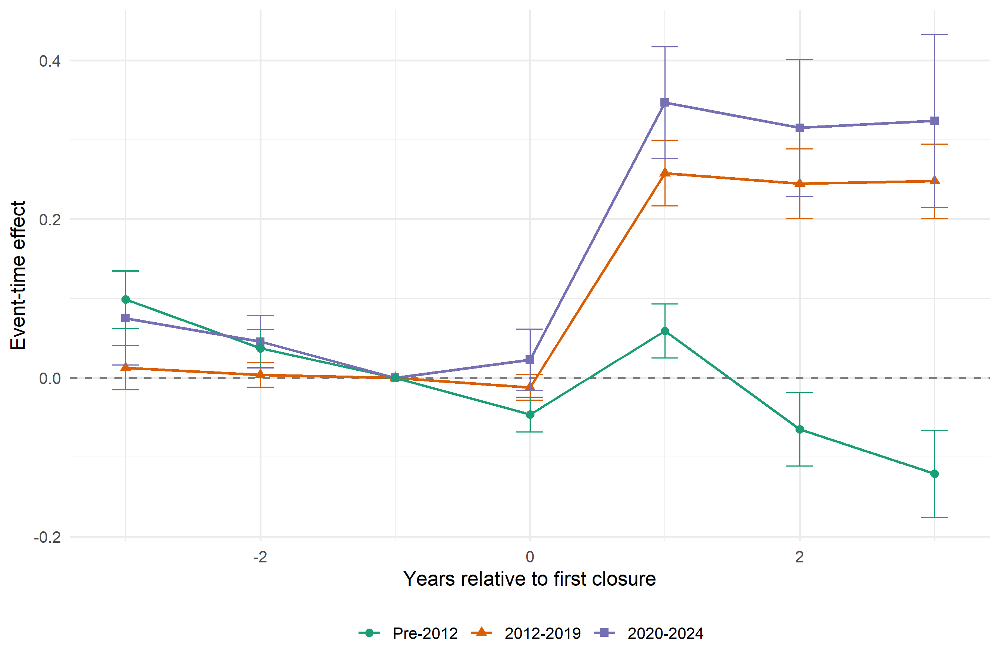

# Version-20260423


---

## 1. Count Treatment (Zip-Year)

**Unit:** zip-year
**LHS:** `(inc_deps_{t+1} − inc_deps_t) / total_zip_deps_{t−1}` — 1-year window; denominator = total zip deposits at t−1
**Treatment:** `fraction_of_branches_closed` = closed branch count / total branch count at t−1
**Incumbent:** bank with NO closes in (zip, YEAR); `!is.na(sophisticated)` filter applied
**FE:** zip + county×year | **SE:** clustered at zip
**Controls:** `log_n_branches`, `log_n_inc_banks`, `log_total_deps`, `dep_growth_t3t1`

```
|                             | 2000–07    | 2008–11    | 2012–19    | 2020–22    | 2023–24    |
|-----------------------------|------------|------------|------------|------------|------------|
| fraction_of_branches_closed | 0.0931***  | 0.0326**   | 0.0126     | 0.0154     | 0.0517*    |
|                             | (0.0138)   | (0.0152)   | (0.0090)   | (0.0205)   | (0.0272)   |
| log_n_branches              | −0.0207**  | 0.0513***  | 0.0164*    | 0.0405**   | −0.0378    |
|                             | (0.0089)   | (0.0113)   | (0.0085)   | (0.0198)   | (0.0287)   |
| log_n_inc_banks             | 0.0986***  | 0.0451***  | 0.0748***  | 0.0922***  | 0.0730***  |
|                             | (0.0080)   | (0.0086)   | (0.0069)   | (0.0171)   | (0.0248)   |
| log_total_deps              | −0.0979*** | −0.1192*** | −0.1048*** | −0.0984*** | −0.0424*** |
|                             | (0.0059)   | (0.0098)   | (0.0083)   | (0.0168)   | (0.0163)   |
| dep_growth_t3t1             | −0.0081*** | −0.0057    | −0.0036    | −0.0795*** | 0.0123     |
|                             | (0.0022)   | (0.0044)   | (0.0028)   | (0.0093)   | (0.0086)   |
| N                           | 51,558     | 44,830     | 89,954     | 31,052     | 20,304     |
| Zip FE                      | Yes        | Yes        | Yes        | Yes        | Yes        |
| County×Year FE              | Yes        | Yes        | Yes        | Yes        | Yes        |
| SE                          | Zip        | Zip        | Zip        | Zip        | Zip        |
| Mean(outcome)               | 0.048      | 0.037      | 0.062      | 0.073      | 0.025      |
| SD(fraction_closed)         | 0.057      | 0.053      | 0.060      | 0.075      | 0.058      |
| R²                          | 0.540      | 0.487      | 0.482      | 0.652      | 0.609      |
| Within R²                   | 0.064      | 0.046      | 0.043      | 0.059      | 0.005      |
```

*Note: \*\*\* p<0.01, \*\* p<0.05, \* p<0.10*

---

## 2. Deposit-Weighted Treatment (Zip-Year)

**Unit:** zip-year
**LHS:** `(inc_deps_{t+1} − inc_deps_t) / total_zip_deps_{t−1}`
**Treatment:** `share_deps_closed` = sum(closed_dep_{t−1}) / total_zip_dep_{t−1}
**Incumbent:** bank with NO closes in (zip, YEAR)
**FE:** zip + county×year | **SE:** clustered at zip
**Controls:** `log_n_branches`, `log_n_inc_banks`, `log_total_deps`, `dep_growth_t3t1`


```
|                       | 2000–07    | 2008–11    | 2012–19    | 2020–22    | 2023–24   |
|-----------------------|------------|------------|------------|------------|-----------|
| share_deps_closed     | 0.1208***  | 0.1048***  | 0.0098     | 0.0584***  | −0.0181   |
|                       | (0.0205)   | (0.0216)   | (0.0100)   | (0.0193)   | (0.0270)  |
| log_n_branches        | −0.0145*   | 0.0474***  | 0.0194**   | 0.0290*    | −0.0032   |
|                       | (0.0085)   | (0.0110)   | (0.0076)   | (0.0171)   | (0.0256)  |
| log_n_inc_banks       | 0.0890***  | 0.0499***  | 0.0713***  | 0.1063***  | 0.0363*   |
|                       | (0.0075)   | (0.0079)   | (0.0058)   | (0.0142)   | (0.0207)  |
| log_total_deps        | −0.0985*** | −0.1202*** | −0.1049*** | −0.1023*** | −0.0402** |
|                       | (0.0059)   | (0.0098)   | (0.0083)   | (0.0174)   | (0.0169)  |
| dep_growth_t3t1       | −0.0081*** | −0.0054    | −0.0036    | −0.0792*** | 0.0122    |
|                       | (0.0022)   | (0.0044)   | (0.0028)   | (0.0094)   | (0.0087)  |
| N                     | 51,558     | 44,830     | 89,954     | 31,052     | 20,304    |
| Zip FE                | Yes        | Yes        | Yes        | Yes        | Yes       |
| County×Year FE        | Yes        | Yes        | Yes        | Yes        | Yes       |
| SE                    | Zip        | Zip        | Zip        | Zip        | Zip       |
| Mean(outcome)         | 0.048      | 0.037      | 0.062      | 0.073      | 0.025     |
| SD(share_deps_closed) | 0.038      | 0.033      | 0.047      | 0.064      | 0.053     |
| R²                    | 0.540      | 0.487      | 0.482      | 0.652      | 0.609     |
| Within R²             | 0.063      | 0.047      | 0.043      | 0.059      | 0.004     |
```

*Note: \*\*\* p<0.01, \*\* p<0.05, \* p<0.10*

---

## 3. Closing-Bank Size Decomposition — Zip-Year

**Unit:** zip-year
**LHS:** deposit reallocation outcome (same as §2)
**Treatment decomposition:**

- `share_deps_closed_top4` = deposits in top-4 (JPM/BAC/WFC/Citi) closing branches / total deps
- `share_deps_closed_large` = large-but-not-top4 (assets > $100B) closing branches / total deps
- `share_deps_closed_small` = all other closing branches / total deps

**FE:** zip + county×year | **SE:** clustered at zip
**Controls:** `log_n_branches`, `log_n_inc_banks`, `log_total_deps`, `dep_growth_t3t1`


```
|                          | 2012–19    | 2020–22    | 2023–24   |
| ------------------------ | ---------- | ---------- | --------- |
| share_deps_closed_top4   | −0.0331**  | 0.0441**   | −0.0201   |
|                          | (0.0141)   | (0.0217)   | (0.0270)  |
| share_deps_closed_large  | 0.0095     | 0.0771**   | −0.0645   |
|                          | (0.0147)   | (0.0308)   | (0.0525)  |
| share_deps_closed_small  | 0.0611***  | 0.0611**   | 0.0570    |
|                          | (0.0157)   | (0.0306)   | (0.0486)  |
| log_n_branches           | 0.0177**   | 0.0278     | −0.0025   |
|                          | (0.0076)   | (0.0173)   | (0.0255)  |
| log_n_inc_banks          | 0.0726***  | 0.1067***  | 0.0398*   |
|                          | (0.0058)   | (0.0142)   | (0.0206)  |
| log_total_deps           | −0.1047*** | −0.1023*** | −0.0422** |
|                          | (0.0083)   | (0.0174)   | (0.0165)  |
| dep_growth_t3t1          | −0.0035    | −0.0794*** | 0.0127    |
|                          | (0.0028)   | (0.0095)   | (0.0086)  |
| N                        | 89,954     | 31,052     | 20,304    |
| Zip FE                   | Yes        | Yes        | Yes       |
| County×Year FE           | Yes        | Yes        | Yes       |
| SE                       | Zip        | Zip        | Zip       |
| Mean(outcome)            | 0.062      | 0.073      | 0.025     |
| SD(share_deps_closed)    | 0.047      | 0.064      | 0.053     |
| R²                       | 0.482      | 0.652      | 0.609     |
| Within R²                | 0.043      | 0.059      | 0.005     |
```

*Note: \*\*\* p<0.01, \*\* p<0.05, \* p<0.10*

---

## 4. Closing-Bank App Decomposition — Zip-Year

**Unit:** zip-year
**LHS:** deposit reallocation outcome (same as §2)
**Treatment decomposition:**

- `share_deps_closed_app` = deposits in non-top4 closing branches with mobile app / total deps
- `share_deps_closed_noapp` = deposits in closing branches without mobile app / total deps
- `share_deps_closed_top4` = deposits in top-4 (JPM/BAC/WFC/Citi) closing branches / total deps

**FE:** zip + county×year | **SE:** clustered at zip
**Controls:** `log_n_branches`, `log_n_inc_banks`, `log_total_deps`, `dep_growth_t3t1`


```
|                          | 2012–19    | 2020–22    | 2023–24   |
| ------------------------ | ---------- | ---------- | --------- |
| share_deps_closed_app    | 0.0224*    | 0.0681***  | −0.0129   |
|                          | (0.0125)   | (0.0257)   | (0.0419)  |
| share_deps_closed_noapp  | 0.0807***  | 0.0924*    | 0.3792    |
|                          | (0.0233)   | (0.0548)   | (0.3930)  |
| share_deps_closed_top4   | −0.0333**  | 0.0442**   | −0.0230   |
|                          | (0.0141)   | (0.0217)   | (0.0273)  |
| log_n_branches           | 0.0179**   | 0.0278     | −0.0035   |
|                          | (0.0076)   | (0.0173)   | (0.0258)  |
| log_n_inc_banks          | 0.0724***  | 0.1068***  | 0.0377*   |
|                          | (0.0058)   | (0.0142)   | (0.0207)  |
| log_total_deps           | −0.1048*** | −0.1022*** | −0.0405** |
|                          | (0.0083)   | (0.0174)   | (0.0169)  |
| dep_growth_t3t1          | −0.0035    | −0.0794*** | 0.0122    |
|                          | (0.0028)   | (0.0095)   | (0.0087)  |
| N                        | 89,954     | 31,052     | 20,304    |
| Zip FE                   | Yes        | Yes        | Yes       |
| County×Year FE           | Yes        | Yes        | Yes       |
| SE                       | Zip        | Zip        | Zip       |
| Mean(outcome)            | 0.062      | 0.073      | 0.025     |
| SD(share_deps_closed)    | 0.047      | 0.064      | 0.053     |
| R²                       | 0.482      | 0.652      | 0.609     |
| Within R²                | 0.043      | 0.059      | 0.005     |
```

*Note: \*\*\* p<0.01, \*\* p<0.05, \* p<0.10*

---

## 5. Mobile Penetration Interaction — Zip-Year

**Unit:** zip-year
**LHS:** deposit reallocation outcome (same as §2)
**Additional variable:** `perc_hh_wMobileSub` = county-year share of households with mobile subscription (raw data: 2007–2023; LOCF-filled within county; 2023 value held for 2024+)
**Interaction:** `share_deps_closed × perc_hh_wMobileSub`
**FE:** zip + county×year | **SE:** clustered at zip
**Controls:** `log_n_branches`, `log_n_inc_banks`, `log_total_deps`, `dep_growth_t3t1`

```
|                                        | 2012–19    | 2020–22    | 2023–24   |
| -------------------------------------- | ---------- | ---------- | --------- |
| share_deps_closed                      | 0.1000***  | −0.3627    | −1.519**  |
|                                        | (0.0276)   | (0.2205)   | (0.7204)  |
| share_deps_closed × perc_hh_wMobileSub | −0.1604*** | 0.5116**   | 1.698**   |
|                                        | (0.0405)   | (0.2600)   | (0.8049)  |
| log_n_branches                         | 0.0134*    | 0.0323*    | 0.0009    |
|                                        | (0.0078)   | (0.0180)   | (0.0269)  |
| log_n_inc_banks                        | 0.0733***  | 0.1148***  | 0.0409*   |
|                                        | (0.0060)   | (0.0144)   | (0.0212)  |
| log_total_deps                         | −0.1017*** | −0.0960*** | −0.0442** |
|                                        | (0.0084)   | (0.0172)   | (0.0172)  |
| dep_growth_t3t1                        | −0.0031    | −0.0811*** | 0.0106    |
|                                        | (0.0029)   | (0.0097)   | (0.0092)  |
| N                                      | 70,195     | 24,272     | 15,792    |
| Zip FE                                 | Yes        | Yes        | Yes       |
| County×Year FE                         | Yes        | Yes        | Yes       |
| SE                                     | Zip        | Zip        | Zip       |
| Mean(outcome)                          | 0.062      | 0.073      | 0.025     |
| SD(share_deps_closed)                  | 0.047      | 0.064      | 0.053     |
| R²                                     | 0.446      | 0.636      | 0.591     |
| Within R²                              | 0.043      | 0.061      | 0.006     |
```

*Note: \*\*\* p<0.01, \*\* p<0.05, \* p<0.10*

---

## 6. Combined Decomposition — Zip-Year

**Unit:** zip-year
**LHS:** deposit reallocation outcome (same as §2)
**All channels simultaneously.** Separate coefficients for app, no-app, top4; interaction with mobile penetration on aggregate closure share.
**FE:** zip + county×year | **SE:** clustered at zip
**Controls:** `log_n_branches`, `log_n_inc_banks`, `log_total_deps`, `dep_growth_t3t1`

```
|                                        | 2012–19    | 2020–22    | 2023–24    |
| -------------------------------------- | ---------- | ---------- | ---------- |
| share_deps_closed_app                  | 0.0981***  | −0.4016*   | −1.568**   |
|                                        | (0.0282)   | (0.2294)   | (0.7204)   |
| share_deps_closed_noapp                | 0.1329***  | −0.3734    | −1.238     |
|                                        | (0.0333)   | (0.2307)   | (0.8323)   |
| share_deps_closed_top4                 | 0.0519*    | −0.4403*   | −1.595**   |
|                                        | (0.0312)   | (0.2375)   | (0.7212)   |
| share_deps_closed × perc_hh_wMobileSub | −0.1363*** | 0.5782**   | 1.771**    |
|                                        | (0.0412)   | (0.2749)   | (0.8054)   |
| log_n_branches                         | 0.0127     | 0.0309*    | 0.0006     |
|                                        | (0.0079)   | (0.0181)   | (0.0270)   |
| log_n_inc_banks                        | 0.0741***  | 0.1158***  | 0.0428**   |
|                                        | (0.0060)   | (0.0145)   | (0.0211)   |
| log_total_deps                         | −0.1016*** | −0.0955*** | −0.0446*** |
|                                        | (0.0084)   | (0.0173)   | (0.0171)   |
| dep_growth_t3t1                        | −0.0031    | −0.0815*** | 0.0106     |
|                                        | (0.0029)   | (0.0097)   | (0.0092)   |
| N                                      | 70,195     | 24,272     | 15,792     |
| Zip FE                                 | Yes        | Yes        | Yes        |
| County×Year FE                         | Yes        | Yes        | Yes        |
| SE                                     | Zip        | Zip        | Zip        |
| Mean(outcome)                          | 0.062      | 0.073      | 0.025      |
| SD(share_deps_closed)                  | 0.047      | 0.064      | 0.053      |
| R²                                     | 0.446      | 0.637      | 0.591      |
| Within R²                              | 0.044      | 0.061      | 0.007      |
```

*Note: \*\*\* p<0.01, \*\* p<0.05, \* p<0.10*

---

## 7. Depositor Sophistication Interaction — Zip-Year

**Interaction:** `share_deps_closed × sophisticated` where `sophisticated` is a zip×year binary from the demographics panel (above-median education AND above-median dividend/capital-gain income).
**Main effect of `sophisticated` included** (dropped in 2000–07 due to collinearity with zip FE).

```
|                                    | 2000–07    | 2008–11    | 2012–13    | 2014–19    | 2020–24    |
| ---------------------------------- | ---------- | ---------- | ---------- | ---------- | ---------- |
| share_deps_closed                  | 0.1219***  | 0.1147***  | 0.0899**   | 0.0208     | 0.0070     |
|                                    | (0.0275)   | (0.0301)   | (0.0403)   | (0.0150)   | (0.0171)   |
| share_deps_closed × sophisticated  | −0.0024    | −0.0179    | 0.0093     | −0.0338**  | 0.0308*    |
|                                    | (0.0375)   | (0.0390)   | (0.0480)   | (0.0172)   | (0.0183)   |
| sophisticated                      |            | 0.0022     | 0.0058     | 0.0039     | −0.0004    |
|                                    |            | (0.0068)   | (0.0061)   | (0.0027)   | (0.0050)   |
| log_n_branches                     | −0.0145*   | 0.0474***  | −0.0723*** | 0.0314***  | 0.0372***  |
|                                    | (0.0085)   | (0.0110)   | (0.0219)   | (0.0101)   | (0.0106)   |
| log_n_inc_banks                    | 0.0890***  | 0.0500***  | 0.0125     | 0.0791***  | 0.0934***  |
|                                    | (0.0075)   | (0.0079)   | (0.0180)   | (0.0073)   | (0.0089)   |
| log_total_deps                     | −0.0985*** | −0.1202*** | −0.0332*   | −0.1071*** | −0.1054*** |
|                                    | (0.0059)   | (0.0098)   | (0.0179)   | (0.0127)   | (0.0122)   |
| dep_growth_t3t1                    | −0.0081*** | −0.0054    | 0.0004     | −0.0208*** | −0.0371*** |
|                                    | (0.0022)   | (0.0044)   | (0.0083)   | (0.0052)   | (0.0057)   |
| N                                  | 51,558     | 44,830     | 22,868     | 66,796     | 51,586     |
| Zip FE                             | Yes        | Yes        | Yes        | Yes        | Yes        |
| County×Year FE                     | Yes        | Yes        | Yes        | Yes        | Yes        |
| SE                                 | Zip        | Zip        | Zip        | Zip        | Zip        |
| Mean(outcome)                      | 0.049      | 0.037      | 0.037      | 0.071      | 0.054      |
| SD(share_deps_cl.)                 | 0.034      | 0.033      | 0.040      | 0.049      | 0.060      |
| R²                                 | 0.540      | 0.487      | 0.645      | 0.511      | 0.568      |
| Within R²                          | 0.063      | 0.047      | 0.005      | 0.045      | 0.057      |
```

*Note: \*\*\* p<0.01, \*\* p<0.05, \* p<0.10*

---

## 8.1 HMDA All Purchase (Zip-Year)

**Unit:** zip-year
**LHS:** `hmda_purch_gr_all` — 2-year symmetric growth of all-purpose purchase originations (`loan_purpose='1'`)
**Treatment:** `share_deps_closed`
**FE:** zip + county×year | **SE:** clustered at zip
**Controls:** `log_n_branches`, `log_n_inc_banks`, `log_total_deps`, `dep_growth_t3t1`

```
|                       | 2000–07   | 2008–11    | 2012–19    | 2020–23   |
|-----------------------|-----------|------------|------------|-----------|
| share_deps_closed     | −0.1584   | −0.2486    | 0.4014**   | 0.2190    |
|                       | (0.4824)  | (0.5595)   | (0.2001)   | (0.2005)  |
| log_n_branches        | −0.3490** | 0.2174     | −0.1517    | 0.1713    |
|                       | (0.1663)  | (0.1830)   | (0.1151)   | (0.1385)  |
| log_n_inc_banks       | −0.2549*  | −0.4013*** | −0.1639    | −0.2909** |
|                       | (0.1491)  | (0.1557)   | (0.1029)   | (0.1213)  |
| log_total_deps        | −0.1759** | 0.2052*    | −0.3172*** | −0.0419   |
|                       | (0.0884)  | (0.1219)   | (0.0572)   | (0.0978)  |
| dep_growth_t3t1       | 0.0975**  | −0.1749**  | 0.0971**   | 0.0224    |
|                       | (0.0469)  | (0.0765)   | (0.0466)   | (0.0745)  |
| N                     | 39,951    | 35,474     | 82,356     | 36,039    |
| Zip FE                | Yes       | Yes        | Yes        | Yes       |
| County×Year FE        | Yes       | Yes        | Yes        | Yes       |
| SE                    | Zip       | Zip        | Zip        | Zip       |
| Mean(outcome)         | 0.732     | 0.417      | 0.565      | 0.089     |
| SD(share_deps_closed) | 0.038     | 0.033      | 0.047      | 0.062     |
| R²                    | 0.467     | 0.534     | 0.396      | 0.457     |
| Within R²             | 0.001     | 0.001     | 0.002      | 0.001     |
```

*Note: \*\*\* p<0.01, \*\* p<0.05, \* p<0.10*

---

## 8.2 HMDA Refinances (Zip-Year)

**Unit:** zip-year
**LHS:** `hmda_refi_gr_all` — 2-year symmetric growth of refinance originations
**Refi definition:** `loan_purpose='3'` pre-2018 LAR schema; `loan_purpose IN ('31','32')` (refinance + cash-out refinance) post-2018
**Treatment:** `share_deps_closed`
**FE:** zip + county×year | **SE:** clustered at zip
**Controls:** `log_n_branches`, `log_n_inc_banks`, `log_total_deps`, `dep_growth_t3t1`

```
|                       | 2000–07   | 2008–11   | 2012–19   | 2020–23   |
|-----------------------|-----------|-----------|-----------|-----------|
| share_deps_closed     | 0.2960    | −0.0432   | 0.0862    | −0.0286   |
|                       | (0.4500)  | (0.5595)  | (0.2131)  | (0.2067)  |
| log_n_branches        | −0.2462*  | 0.3317    | 0.1046    | 0.0702    |
|                       | (0.1467)  | (0.2183)  | (0.1259)  | (0.1510)  |
| log_n_inc_banks       | 0.0114    | −0.4522** | −0.1364   | −0.1491   |
|                       | (0.1335)  | (0.1892)  | (0.1156)  | (0.1274)  |
| log_total_deps        | −0.1460*  | −0.0326   | −0.1000*  | −0.0615   |
|                       | (0.0792)  | (0.1527)  | (0.0601)  | (0.0827)  |
| dep_growth_t3t1       | 0.1406*** | −0.2386** | −0.0079   | 0.0600    |
|                       | (0.0417)  | (0.0938)  | (0.0468)  | (0.0671)  |
| N                     | 41,897    | 37,103    | 82,433    | 35,145    |
| Zip FE                | Yes       | Yes       | Yes       | Yes       |
| County×Year FE        | Yes       | Yes       | Yes       | Yes       |
| SE                    | Zip       | Zip       | Zip       | Zip       |
| Mean(outcome)         | 1.059     | 1.166     | 0.605     | 0.003     |
| SD(share_deps_closed) | 0.038     | 0.033     | 0.047     | 0.062     |
| R²                    | 0.456     | 0.558     | 0.527     | 0.587     |
| Within R²             | 0.001     | 0.001     | 0.000     | 0.000     |
```

*Note: \*\*\* p<0.01, \*\* p<0.05, \* p<0.10*

---

## 9. HMDA Second-Lien Only (Zip-Year)

**Unit:** zip-year (restricted to zip-years with ≥1 second-lien origination)
**LHS:** `hmda_purch_gr_sl` — 2-year growth of second-lien purchase originations
**Treatment:** `share_deps_closed`
**FE:** zip + county×year | **SE:** clustered at zip

```
|                       | 2004–07  | 2008–11  | 2012–19  | 2020–23  |
|-----------------------|----------|----------|----------|----------|
| share_deps_closed     | −14.46   | −27.05   | −15.42   | 16.90    |
|                       | (9.768)  | (17.10)  | (11.18)  | (13.76)  |
| log_n_branches        | −3.257   | 10.25    | 10.76    | −6.232   |
|                       | (3.706)  | (8.061)  | (7.224)  | (8.031)  |
| log_n_inc_banks       | −6.843** | −2.173   | −5.361   | 0.002    |
|                       | (3.194)  | (5.652)  | (6.335)  | (7.612)  |
| log_total_deps        | 0.8746   | 1.897    | −1.245   | −1.429   |
|                       | (1.851)  | (2.943)  | (2.391)  | (6.545)  |
| dep_growth_t3t1       | −0.5189  | −1.764   | −0.7267  | −1.267   |
|                       | (1.081)  | (3.238)  | (2.702)  | (4.061)  |
| N                     | 11,973   | 3,408    | 7,612    | 4,035    |
| Zip FE                | Yes      | Yes      | Yes      | Yes      |
| County×Year FE        | Yes      | Yes      | Yes      | Yes      |
| SE                    | Zip      | Zip      | Zip      | Zip      |
| Mean(outcome)         | 4.986    | 4.915    | 8.296    | 7.948    |
| SD(share_deps_closed) | 0.033    | 0.033    | 0.047    | 0.062    |
| R²                    | 0.575    | 0.545    | 0.508    | 0.530    |
| Within R²             | 0.001    | 0.002    | 0.001    | 0.001    |
```

*Note: \*\*\* p<0.01, \*\* p<0.05, \* p<0.10*

---

## 10. HMDA Jumbo Only (Zip-Year, 2012+)

**Unit:** zip-year (loan_amount > county-year FHFA 1-unit conforming limit)
**LHS:** `hmda_purch_gr_jumbo`
**Treatment:** `share_deps_closed`
**FE:** zip + county×year | **SE:** clustered at zip

```
|                       | 2012–19    | 2020–23   |
|-----------------------|------------|-----------|
| share_deps_closed     | −0.0599    | 0.2072    |
|                       | (0.1396)   | (0.1539)  |
| log_n_branches        | 0.0485     | 0.1550    |
|                       | (0.0801)   | (0.1023)  |
| log_n_inc_banks       | −0.2658*** | −0.1892** |
|                       | (0.0747)   | (0.0933)  |
| log_total_deps        | −0.0680*   | −0.0351   |
|                       | (0.0392)   | (0.0798)  |
| dep_growth_t3t1       | 0.0094     | −0.0005   |
|                       | (0.0310)   | (0.0573)  |
| N                     | 72,585     | 36,039    |
| Zip FE                | Yes        | Yes       |
| County×Year FE        | Yes        | Yes       |
| SE                    | Zip        | Zip       |
| Mean(outcome)         | 0.340      | 0.050     |
| SD(share_deps_closed) | 0.047      | 0.062     |
| R²                    | 0.336      | 0.467     |
| Within R²             | 0.001      | 0.001     |
```

*Note: \*\*\* p<0.01, \*\* p<0.05, \* p<0.10*

---

## 11. CRA Small-Business (County-Year)

**Unit:** county-year
**LHS:** 2-year symmetric growth of CRA small-business originations
**Treatment:** `share_deps_closed`
**FE:** county + state×year | **SE:** clustered at county
**Controls:** `log_n_branches`, `log_n_banks`, `log1p_total_deps`, `county_dep_growth_t4_t1`, `log_population_density`, `lag_county_deposit_hhi`, `lag_establishment_gr`, `lag_payroll_gr`, `lag_hmda_mtg_amt_gr`, `lag_cra_loan_amount_amt_lt_1m_gr`, `lmi`

```
|                       | 2000–07   | 2008–11   | 2012–19   | 2020–23   |
|-----------------------|-----------|-----------|-----------|-----------|
| share_deps_closed     | −0.3500*  | −0.2361   | 0.0976    | 0.2863    |
|                       | (0.1924)  | (0.4306)  | (0.1664)  | (0.2168)  |
| log_n_branches        | 0.0482    | 0.0653    | −0.0443   | −0.1249   |
|                       | (0.1639)  | (0.1860)  | (0.1174)  | (0.1787)  |
| log_n_banks           | 0.0293    | 0.0758    | 0.0287    | 0.0284    |
|                       | (0.1284)  | (0.1531)  | (0.0960)  | (0.1685)  |
| log1p_total_deps      | 0.1088    | −0.1341   | −0.1453** | 0.0320    |
|                       | (0.0892)  | (0.0998)  | (0.0603)  | (0.0774)  |
| N                     | 9,203     | 9,197     | 19,558    | 9,830     |
| County FE             | Yes       | Yes       | Yes       | Yes       |
| State×Year FE         | Yes       | Yes       | Yes       | Yes       |
| SE                    | County    | County    | County    | County    |
| Mean(outcome)         | 0.150     | −0.058    | 0.191     | −0.075    |
| SD(share_deps_closed) | 0.037     | 0.033     | 0.041     | 0.051     |
| R²                    | 0.387     | 0.396     | 0.370     | 0.570     |
| Within R²             | 0.021     | 0.041     | 0.027     | 0.045     |
```

*Note: \*\*\* p<0.01, \*\* p<0.05, \* p<0.10*

---

## 12. Own-Closure Deposit Retention (Bank-Zip-Year)

**Unit:** bank-zip-year (closing bank only; remaining branches)
**LHS:** `growth_on_total_t1` = (deps_bank_zip_{t+1} − deps_bank_zip_t) / total_deps_bank_zip_{t−1}
**Treatment:** `closure_share` — bank's zip-level closure intensity
**FE:** bank×year + zip×year | **SE:** clustered at bank
**Controls:** `log1p(total_deps_bank_zip_t1)`, `log1p(n_remaining_branches)`, `mkt_share_zip_t1`

```
|                               | All        | Pre-2012   | 2012–19    | 2020–22    | 2023–24    |
|-------------------------------|------------|------------|------------|------------|------------|
| closure_share                 | 0.6522***  | 0.5687***  | 0.6626***  | 0.6475***  | 0.6900***  |
|                               | (0.0203)   | (0.0274)   | (0.0173)   | (0.0470)   | (0.0226)   |
| log1p(total_deps_bank_zip_t1) | −0.1964*** | −0.2345*** | −0.1728*** | −0.1574*** | −0.1933*** |
|                               | (0.0048)   | (0.0053)   | (0.0053)   | (0.0090)   | (0.0135)   |
| log1p(n_remaining_branches)   | 0.2163***  | 0.2520***  | 0.1901***  | 0.1856***  | 0.1921***  |
|                               | (0.0095)   | (0.0112)   | (0.0102)   | (0.0143)   | (0.0135)   |
| mkt_share_zip_t1              | 0.2944***  | 0.3299***  | 0.3067***  | 0.2117***  | 0.3574***  |
|                               | (0.0130)   | (0.0171)   | (0.0194)   | (0.0198)   | (0.0268)   |
| N                             | 1,273,020  | 513,664    | 483,475    | 165,719    | 110,162    |
| Bank×Year FE                  | Yes        | Yes        | Yes        | Yes        | Yes        |
| Zip×Year FE                   | Yes        | Yes        | Yes        | Yes        | Yes        |
| SE                            | Bank       | Bank       | Bank       | Bank       | Bank       |
| Mean(growth_on_total_t1)      | 0.174      | 0.173      | 0.165      | 0.263      | 0.080      |
| SD(closure_share)             | 0.032      | 0.026      | 0.034      | 0.045      | 0.031      |
| R²                            | 0.522      | 0.584      | 0.451      | 0.489      | 0.454      |
| Within R²                     | 0.193      | 0.255      | 0.157      | 0.121      | 0.202      |
```

*Note: \*\*\* p<0.01, \*\* p<0.05, \* p<0.10*

---

## 13. Sun & Abraham Event Study (Consistent Branch Set)

**Unit:** bank-county-year (branches that do not close in the cohort year)
**LHS:** `log1p(deps_consistent)`
**Method:** Sun & Abraham (2021); cohort = first closure year; reference period = −1
**FE:** unit_id + YEAR | **SE:** clustered at bank_id
**Window:** ±3 years around first closure; periods superimposed: Pre-2012, 2012–2019, 2020–2024



```
| event_time | Pre-2012 | 2012–2019 | 2020–2024 |
|------------|----------|-----------|-----------|
| −3         | 0.099    | 0.013     | 0.075     |
| −2         | 0.037    | 0.004     | 0.046     |
| −1         | 0.000    | 0.000     | 0.000     |
| 0          | −0.046   | −0.012    | 0.023     |
| +1         | 0.059    | 0.258     | 0.347     |
| +2         | −0.065   | 0.245     | 0.315     |
| +3         | −0.121   | 0.248     | 0.324     |
```

---

*Sources: `code/approach-streamlined-20260423/01_zip_reallocation.R` (§§1–2), `02_decompositions.R` (§§3–7), `03_hmda_zip.R` (§§8–10), `04_cra_county.R` (§11), `05_own_closure.R` (§12), `06_sunab_eventstudy.R` (§13).*
