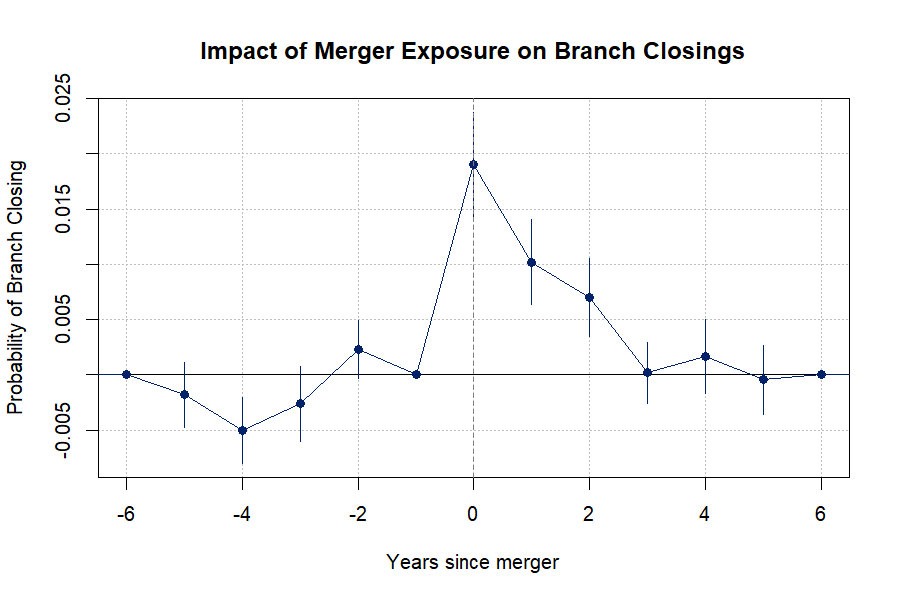

# Snapshot: approach-merger-iv-20260424

> 

---

## 1. Nguyen (2019) Figure 2 — Impact of Merger Exposure on Branch Closings

**Unit:** branch-year (brick-and-mortar + drive-through, SOD BRSERTYP ∈ {11, 12, 21})
**LHS:** `closed` = 1 if UNINUMBR present in YEAR but absent in YEAR+1
**Treatment:** `i(rel_year, ref = −1, keep = −5:5)` — event-time dummies around ZIP's first Event_Year
**FE:** ZIPBR + YEAR | **SE:** clustered at STCNTYBR (county)
**Sample:** treated ZIPs (overlap in ≥1 large merger) + all other ZIPs as never-treated controls; controls assigned `rel_year = −1000` and excluded from `keep` window



```
| rel_year | coef        | se      | 95% CI lo | 95% CI hi |
|---------:|------------:|--------:|----------:|----------:|
|       −5 | −0.00180    | 0.00148 | −0.00471  |  0.00111  |
|       −4 | −0.00500**  | 0.00153 | −0.00801  | −0.00199  |
|       −3 | −0.00262    | 0.00173 | −0.00601  |  0.00077  |
|       −2 |  0.00230    | 0.00134 | −0.00033  |  0.00492  |
|        0 |  0.01903*** | 0.00241 |  0.01432  |  0.02375  |
|        1 |  0.01022*** | 0.00196 |  0.00637  |  0.01407  |
|        2 |  0.00703*** | 0.00179 |  0.00351  |  0.01054  |
|        3 |  0.00022    | 0.00141 | −0.00254  |  0.00298  |
|        4 |  0.00169    | 0.00172 | −0.00167  |  0.00506  |
|        5 | −0.00045    | 0.00159 | −0.00356  |  0.00267  |
| N        |             |         |           |  2,250,571|
| ZIPBR FE |             |         |           |  22,959   |
| YEAR FE  |             |         |           |  26       |
| SE       |             |         |           |  STCNTYBR |
```

*Note: \*\*\* p<0.01, \*\* p<0.05, \* p<0.10*

---

## 2. First Stage — `share_deps_closed ~ Expose_Event`

**Unit:** zip-year
**LHS:** `share_deps_closed` = sum(closed_dep_{t−1}) / total_zip_dep_{t−1}
**Instrument:** `Expose_Event` = 1 if ZIP exposed to a large merger with Event_Year = YEAR
**FE:** zip + YEAR | **SE:** clustered at zip
**Sample:** `branches_lag1 ≥ 2` AND `n_inc_banks ≥ 2`. "Share > 0" subsamples to ZIP-years with any closure.

```
|                         | Full Sample       | Share > 0         |
|-------------------------|-------------------|-------------------|
| Expose_Event            | 0.0131***         | 0.0182***         |
|                         | (0.0013)          | (0.0031)          |
| log1p(branches_lag1)    | 0.0204***         | −0.0873***        |
|                         | (0.0007)          | (0.0052)          |
| N                       | 284,586           | 29,954            |
| Zip FE                  | Yes               | Yes               |
| YEAR FE                 | Yes               | Yes               |
| SE                      | Zip               | Zip               |
| Mean(share_deps_closed) | 0.010             | 0.089             |
| SD(Expose_Event)        | 0.103             | 0.174             |
| R²                      | 0.077             | 0.450             |
| F(Expose_Event)         | 45.625            | 220.582           |
```

*Note: \*\*\* p<0.01, \*\* p<0.05, \* p<0.10*

---

## 3. IV Second Stage — Incumbent Reallocation (period split, Panel-B-aligned)

**Unit:** zip-year
**LHS:** `outcome` = (inc_deps_{t+1} − inc_deps_t) / total_zip_deps_{t−1} — 1-year incumbent reallocation
**Treatment:** `share_deps_closed`, instrumented by `Expose_Event`
**FE:** zip + county×year | **SE:** clustered at zip
**Controls:** `log_n_branches`, `log_n_inc_banks`, `log_total_deps`, `dep_growth_t3t1`
**Sample:** streamlined `zip_tech_sample_20260423.rds` filtered by period only (same as `T1_panelB_depwt`)

```
|                           | 2000–07    | 2008–11    | 2012–19    | 2020–22    | 2023–24   |
|---------------------------|------------|------------|------------|------------|-----------|
| share_deps_closed (IV)    | −4.270     | 1.141      | −2.106     | −2.251*    | 0.353     |
|                           | (9.070)    | (0.718)    | (1.459)    | (1.293)    | (0.634)   |
| log_n_branches            | 0.356      | −0.056     | 0.538      | 0.814*     | −0.135    |
|                           | (0.766)    | (0.073)    | (0.358)    | (0.440)    | (0.227)   |
| log_n_inc_banks           | −0.436     | 0.189**    | −0.584     | −0.802     | 0.181     |
|                           | (1.086)    | (0.096)    | (0.452)    | (0.508)    | (0.247)   |
| log_total_deps            | −0.130**   | −0.129***  | −0.067**   | 0.058      | −0.074    |
|                           | (0.064)    | (0.012)    | (0.028)    | (0.094)    | (0.061)   |
| dep_growth_t3t1           | −0.009**   | −0.002     | −0.011*    | −0.089***  | 0.017     |
|                           | (0.004)    | (0.005)    | (0.006)    | (0.017)    | (0.012)   |
| N                         | 51,558     | 44,830     | 89,954     | 31,052     | 20,304    |
| Zip FE                    | Yes        | Yes        | Yes        | Yes        | Yes       |
| County×Year FE            | Yes        | Yes        | Yes        | Yes        | Yes       |
| SE                        | Zip        | Zip        | Zip        | Zip        | Zip       |
| Mean(outcome)             | 0.048      | 0.037      | 0.062      | 0.073      | 0.025     |
| SD(share_deps_closed)     | 0.038      | 0.033      | 0.047      | 0.064      | 0.053     |
| SD(Expose_Event)          | 0.122      | 0.111      | 0.091      | 0.077      | 0.095     |
| R²                        | 0.539      | 0.487      | 0.482      | 0.652      | 0.609     |
| F-test (1st stage)        | 0.646      | 41.657     | 7.280      | 12.174     | 20.355    |
```

*Note: \*\*\* p<0.01, \*\* p<0.05, \* p<0.10*

---

## Contrast — OLS (streamlined T1 Panel B) vs IV (this snapshot)

| Period  | OLS coef (streamlined) | IV coef (this) | IV-F  |
| ------- | ---------------------- | -------------- | -----:|
| 2000–07 | 0.1208***              | −4.270         | 0.65  |
| 2008–11 | 0.1048***              | 1.141          | 41.66 |
| 2012–19 | 0.0098                 | −2.106         | 7.28  |
| 2020–22 | 0.0584***              | −2.251*        | 12.17 |
| 2023–24 | −0.0181                | 0.353          | 20.36 |


---

## Instrument Build Diagnostics

- NIC `transformations` rows with `TRNSFM_CD = '1'` (2001–2024): 21,417
- After $10B (SOD ASSET in $000s, cutoff 1e7) filter on both parties: 114 mergers
- Treated (ZIP × Event_Year × TRANSNUM) rows: 3,152
- Distinct treated (ZIP, Event_Year): 3,101


---

*Sources: `code/approach-merger-iv-20260424/01_validate_sod_source.R`, `02_build_branch_panel.R`, `03_build_merger_instrument.R`, `04_nguyen_figure2.R`, `05_first_stage.R`, `06_iv_second_stage.R`*
